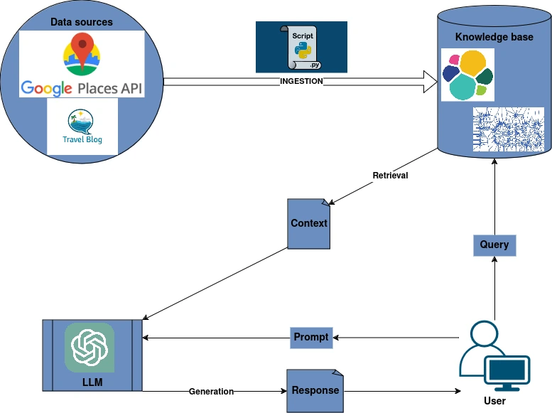
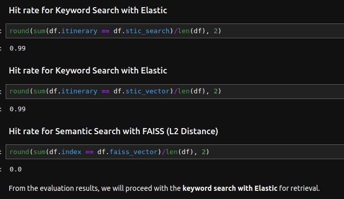
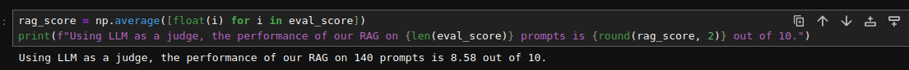

# Travel Itinerary Planner (TIP)

<p align="center">
  
</p>

[](https://www.python.org/downloads/)
[](https://streamlit.io/)
[](https://opensource.org/licenses/MIT)

## Table of Contents
- [Overview](#overview)
- [Features](#features)
- [Data Sources](#data-sources)
- [Technical Architecture](#technical-architecture)
- [Evaluation](#evaluation)
- [Demo](#demo)
- [Deployment](#deployment)
- [Monitoring](#monitoring)
- [Getting Started](#getting-started)
- [Configuration](#configuration)
- [Execution](#execution)
- [Known Issues and Limitations](#known-issues-and-limitations)
- [Future Work](#future-work)
- [Contributing](#contributing)
- [Acknowledgements](#acknowledgements)
- [License](#license)

## Overview

TIP is an AI-powered Travel Itinerary Planner using Retrieval-Augmented Generation (RAG) to create personalized itineraries for short trips (1-7 days) to Barcelona. Inspired by living in one of Europe's top travel destinations, TIP takes into account weather, activity preferences, and duration of stay to provide tailored recommendations.

## Features

- Personalized itineraries for 1-7 day trips to Barcelona
- Considers user preferences for activities:
  - Sightseeing
  - Dining
  - Adventure
  - Culture
  - Relaxation
- Adapts recommendations based on the selected month of travel
- User-friendly interface powered by Streamlit

## Data Sources

TIP relies on two primary data sources:

1. **Local Attractions and Activities**: Obtained using Google Places API
2. **Travel Guides and Blogs**: Collected through web scraping

## Technical Architecture

### Ingestion

Data ingestion is performed through the `ingestion.ipynb` notebook. To execute this process, a Google Places API key is required.

### RAG Flow

<p align="center">
  
</p>

The RAG flow involves:

1. **Data Collection**: Using Google Places API and web scraping
2. **Knowledge Base**: Data is ingested into two systems:
   - Elasticsearch
   - FAISS (Facebook AI Similarity Search)
3. **Retrieval Methods**:
   - Keyword Search with Elasticsearch
   - Semantic Search with Elasticsearch (Cosine Similarity)
   - Semantic Search with FAISS (L2 Distance)
4. **Generation**: Powered by OpenAI's ChatGPT 4.0-mini, implemented in the `rag.py` script

## Evaluation

### Retrieval Performance

The three retrieval approaches were evaluated using Hit-rate:

<p align="center">
  
</p>

Keyword search with Elasticsearch was chosen for its performance and lower computational requirements.

### RAG Performance

The RAG system was evaluated on 140 prompts using an LLM as a judge:

<p align="center">
  
</p>

Average score: 8.58 out of 10

## Demo

The main application is located in the `tip_app.py` file. The user interface is built using Streamlit.

[](https://youtu.be/ZtX04XflwiA)

## Deployment

The application is deployed on Streamlit Community Cloud. [Try it here](https://f-u-njoku-travel-itinerary-builder-tip-app-fagzoi.streamlit.app/)

## Monitoring

User feedback is collected via thumbs-up and down buttons. This data is monitored in a Plotly dashboard displayed using Streamlit.

[](https://youtu.be/SWm8kX58fZg)

## Getting Started

1. Clone the repository:
   ```
   git clone https://github.com/yourusername/travel-itinerary-planner.git
   cd travel-itinerary-planner
   ```

2. Set up a virtual environment (optional but recommended):
   ```
   python -m venv venv
   source venv/bin/activate  # On Windows, use `venv\Scripts\activate`
   ```

3. Install dependencies:
   ```
   pip install -r requirements.txt
   ```

4. Set up your Google Places API key (see [Configuration](#configuration))

5. Run the ingestion notebook:
   ```
   jupyter notebook ingestion.ipynb
   ```

6. Launch the Streamlit app:
   ```
   streamlit run tip_app.py
   ```

## Configuration

1. Create a `.env` file in the project root directory
2. Add your Google Places and OpenAI API keys:
   ```
   GOOGLE_PLACES_API_KEY=your_api_key_here
   OPENAI_PLACES_API_KEY=your_api_key_here
   ```
3. (Optional) Configure Elasticsearch settings in `config.py`:
   ```python
   ELASTICSEARCH_HOST = "localhost"
   ELASTICSEARCH_PORT = 9200
   ```

## Execution

To run the evaluation file:

```
jupyter notebook evaluations.ipynb
```

For an easier run, the notebook has it all from ingestion to RAG evaluation:

```
jupyter notebook travel_guide_generator.ipynb
```

## Known Issues and Limitations

- The current version only supports trips to Barcelona
- Weather data is based on historical averages and may not reflect real-time conditions
- The system may occasionally generate inconsistent itineraries for very short (1-day) trips

## Future Work

- Extend the project to cover more cities
- Implement real-time weather data integration
- Experiment with other LLMs besides ChatGPT
- Develop a mobile app version of TIP

## Contributing

We welcome contributions to the Travel Itinerary Planner! Here's how you can help:

1. Fork the repository
2. Create a new branch (`git checkout -b feature/AmazingFeature`)
3. Make your changes
4. Commit your changes (`git commit -m 'Add some AmazingFeature'`)
5. Push to the branch (`git push origin feature/AmazingFeature`)
6. Open a Pull Request

Please ensure your code adheres to the project's coding standards and includes appropriate tests.

## Acknowledgements

Special thanks to the Datatalks club for providing a practical and free course on Large Language Models. Gratitude to Alexey and the entire team for their efforts.

## License

This project is licensed under the MIT License - see the [LICENSE](LICENSE) file for details.
